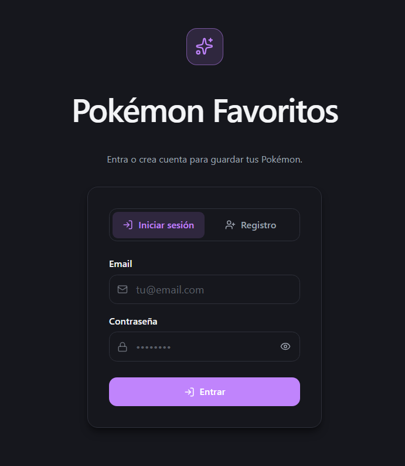
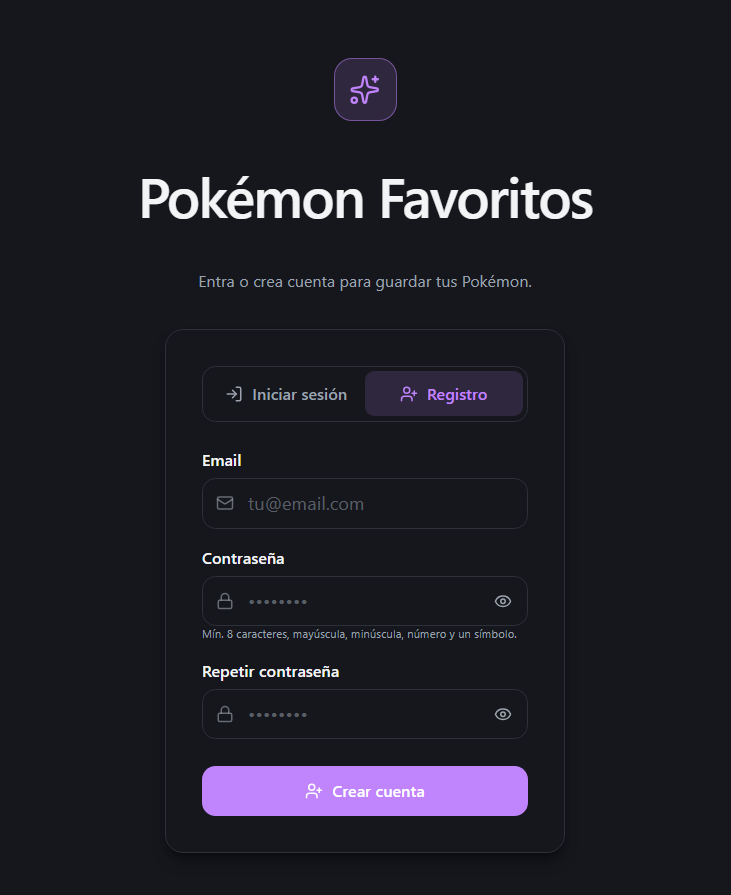
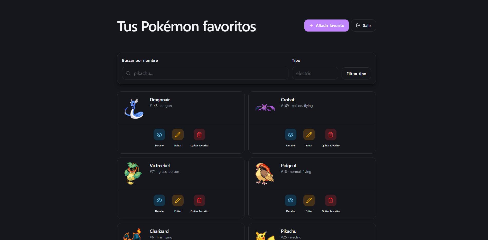
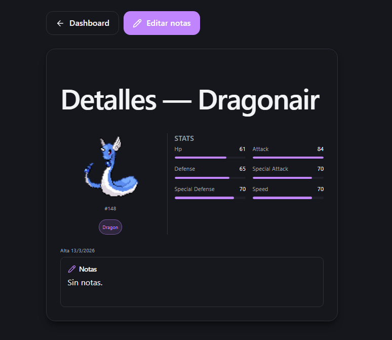
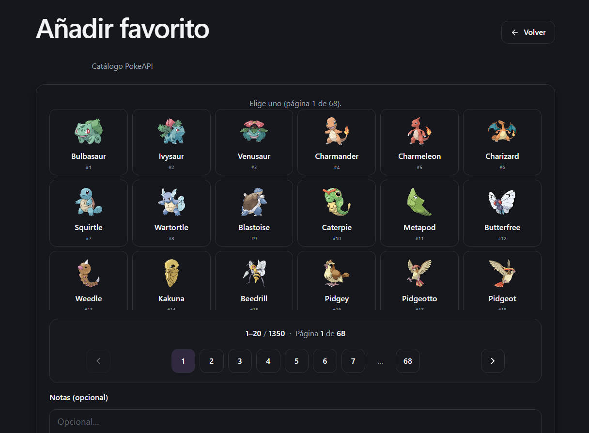
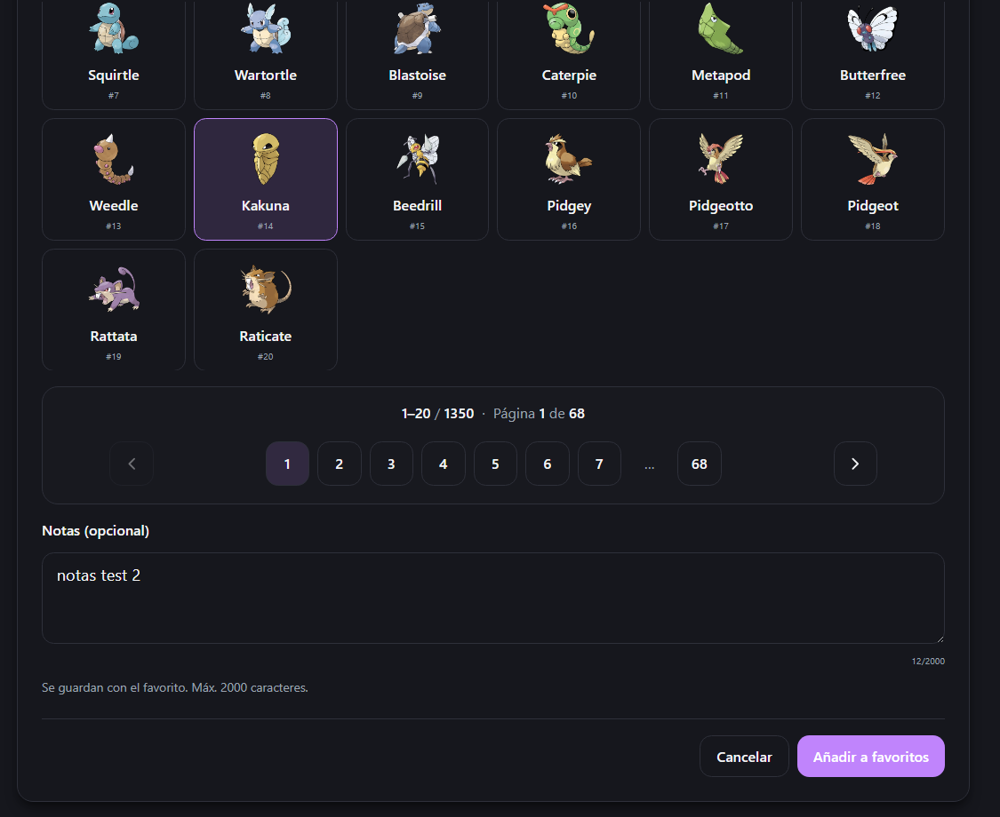
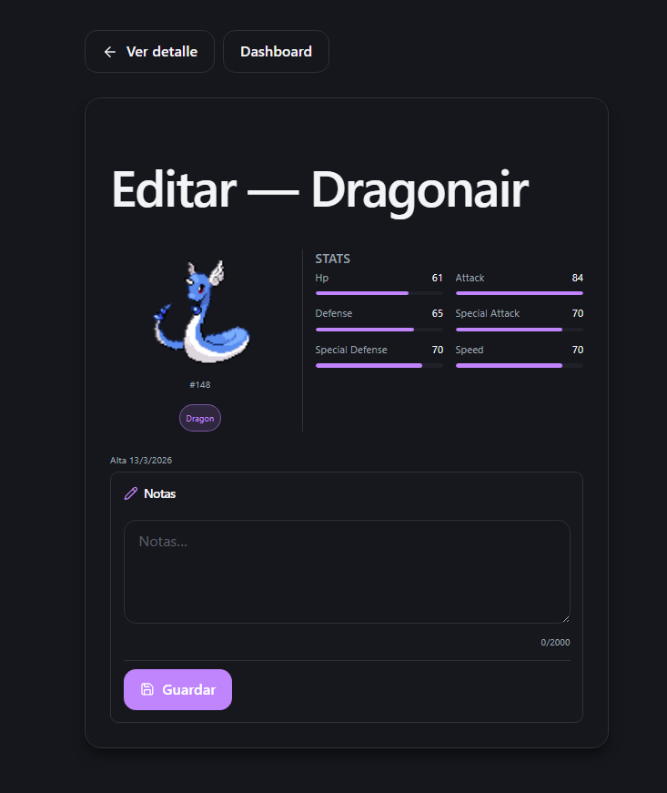

# Prueba técnica full-stack — Gestión de Pokémon favoritos

Monorepo con **frontend** (React + TypeScript + Vite) y **backend** (NestJS + MySQL + TypeORM). Cumple el alcance descrito en `Prueba tecnica.md` (auth JWT, CRUD de favoritos, integración con [PokéAPI](https://pokeapi.co/)).

---

## Estructura del repositorio


| Ruta                | Descripción                                                                       |
| ------------------- | --------------------------------------------------------------------------------- |
| `frontend/`         | SPA: login/registro, dashboard de favoritos, detalle, alta desde catálogo PokeAPI |
| `backend/`          | API REST NestJS, JWT, MySQL, caché local de datos PokeAPI                         |
| `Prueba tecnica.md` | Enunciado original, criterios de evaluación y checklist                           |
| `screenshots/`      | Capturas de la UI (referenciadas abajo)                                           |


---

## Stack


| Capa     | Tecnologías                                                                                  |
| -------- | -------------------------------------------------------------------------------------------- |
| Frontend | React 19, TypeScript, Vite 7, React Router 7, React Hook Form, Axios, Tailwind CSS 4, Sonner |
| Backend  | NestJS 11, TypeORM, MySQL (`mysql2`), Passport JWT, bcryptjs, class-validator                |
| Externa  | PokéAPI (`https://pokeapi.co/api/v2/pokemon/`)                                               |


---

## Requisitos de entorno

- **Node.js** 20+
- **MySQL** 8+
- Gestor de paquetes: `npm` (o el que uses de forma equivalente)

---

## Base de datos (MySQL)

```sql
CREATE DATABASE pokemon_app CHARACTER SET utf8mb4 COLLATE utf8mb4_unicode_ci;
```

El backend puede sincronizar el esquema en desarrollo con `DB_SYNC=true`. En producción usar migraciones y `DB_SYNC=false`.

---

## Variables de entorno

### Backend (`backend/.env`)

Copia `backend/env.template` a `backend/.env` y ajusta. Variables:


| Variable      | Ejemplo                 | Descripción                      |
| ------------- | ----------------------- | -------------------------------- |
| `DB_HOST`     | `localhost`             | Host MySQL                       |
| `DB_PORT`     | `3306`                  | Puerto MySQL                     |
| `DB_USER`     | `root`                  | Usuario                          |
| `DB_PASSWORD` |                         | Contraseña                       |
| `DB_NAME`     | `pokemon_app`           | Base de datos                    |
| `DB_SYNC`     | `true`                  | Solo desarrollo; `false` en prod |
| `DB_LOGGING`  | `false`                 | `true` para ver SQL en consola   |
| `JWT_SECRET`  | (cadena fuerte)         | Firma JWT                        |
| `JWT_EXPIRES` | `7d`                    | Expiración del token             |
| `PORT`        | `3000`                  | Puerto del API                   |
| `CORS_ORIGIN` | `http://localhost:5173` | Origen permitido del front       |


### Frontend (`frontend/.env`)


| Variable       | Ejemplo                 | Descripción                                                           |
| -------------- | ----------------------- | --------------------------------------------------------------------- |
| `VITE_API_URL` | `http://localhost:3000` | URL base del backend (por defecto en código: `http://localhost:3000`) |


---

## Instalación y ejecución

### Backend

```bash
cd backend
npm install
npm run start:dev
```

API por defecto: `http://localhost:3000` (ajustar con `PORT`).

### Frontend

```bash
cd frontend
npm install
npm run dev
```

App por defecto: `http://localhost:5173`.

Orden recomendado: levantar MySQL, backend y después frontend.

---

## API REST (resumen)

Cabecera en rutas protegidas: `Authorization: Bearer <access_token>` (token devuelto por login).


| Método   | Ruta                         | Auth | Descripción                                                                      |
| -------- | ---------------------------- | ---- | -------------------------------------------------------------------------------- |
| `POST`   | `/auth/register`             | no   | Body: `{ "email", "password" }`                                                  |
| `POST`   | `/auth/login`                | no   | Body: `{ "email", "password" }` — respuesta incluye `access_token`               |
| `GET`    | `/pokemon`                   | sí   | Query: `page`, `limit`, `search` (nombre), `type` (tipo PokeAPI, ej. `electric`) |
| `GET`    | `/pokemon/:id`               | sí   | Detalle de favorito por UUID                                                     |
| `POST`   | `/pokemon`                   | sí   | Body: `{ "pokeapiId": number, "notes"?: string }`                                |
| `PUT`    | `/pokemon/:id`               | sí   | Body: `{ "notes": string }`                                                      |
| `DELETE` | `/pokemon/:id`               | sí   | Elimina favorito                                                                 |
| `GET`    | `/pokeapi/catalog?page=0`    | no   | Listado paginado del catálogo (20 por página)                                    |
| `GET`    | `/pokeapi/pokemon/:idOrName` | no   | Detalle + caché local                                                            |


Detalle ampliado y notas de diseño: `backend/README.md`.

### Ejemplos rápidos

**Registro**

```http
POST /auth/register
Content-Type: application/json

{ "email": "user@example.com", "password": "tuPasswordSeguro" }
```

**Login**

```http
POST /auth/login
Content-Type: application/json

{ "email": "user@example.com", "password": "tuPasswordSeguro" }
```

**Listar favoritos**

```http
GET /pokemon?page=0&limit=20&search=&type=
Authorization: Bearer <access_token>
```

**Añadir favorito**

```http
POST /pokemon
Authorization: Bearer <access_token>
Content-Type: application/json

{ "pokeapiId": 25, "notes": "Opcional" }
```

---

## Frontend — páginas y comportamiento

- **Auth** — Login y registro; token persistido para llamadas al API.
- **Dashboard** — Listado paginado de favoritos, búsqueda/filtro según backend.
- **Detalle** — Vista de un favorito concreto.
- **Alta** — Exploración del catálogo PokeAPI y alta como favorito (notas opcionales, validación de longitud).

Estilos centralizados en `frontend/src/constants/styles.ts` (coherencia con Tailwind y variables CSS).

---

## Scripts útiles


| Ubicación   | Comando              | Acción               |
| ----------- | -------------------- | -------------------- |
| `backend/`  | `npm run start:dev`  | Nest en modo watch   |
| `backend/`  | `npm run build`      | Compilación          |
| `backend/`  | `npm run start:prod` | Ejecutar `dist/main` |
| `frontend/` | `npm run dev`        | Vite dev server      |
| `frontend/` | `npm run build`      | Build de producción  |
| `frontend/` | `npm run lint`       | ESLint               |


---

## Capturas de la UI

Archivos en `screenshots/`.

### Login



### Registro



### Dashboard (favoritos)



### Detalle de favorito



### Alta desde catálogo





### Edición (notas)



---

## Entregables y documentación adicional

- **Postman**: conviene una colección con los endpoints anteriores (el enunciado en `Prueba tecnica.md` lo pide como entregable).
- **README del backend**: `backend/README.md` (API, env, MySQL).
- **Capturas de UI**: incluidas arriba y en la carpeta `screenshots/`.

---

## Recursos

- PokéAPI: [https://pokeapi.co/](https://pokeapi.co/)
- React: [https://react.dev/](https://react.dev/)
- NestJS: [https://docs.nestjs.com/](https://docs.nestjs.com/)

---

## Checklist de verificación (enunciado)

- Endpoints de auth y CRUD favoritos operativos
- JWT en rutas protegidas
- Integración PokéAPI con listado paginado y caché en servidor
- Frontend responsive y manejo de errores / loading
- README e instrucciones de entorno claras

Lista completa en `Prueba tecnica.md` (sección Checklist de Verificación).